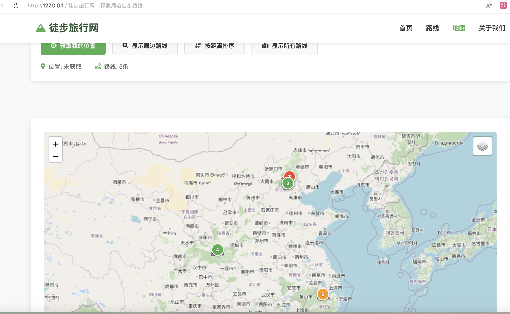

# AI 编程面试项目: "DevMate" - 智能编程助手

## 1. 项目概览
**DevMate** 是一个 AI 驱动的编程助手，旨在帮助开发者生成和修改代码库。该项目的核心目标是评估候选人构建 Agent 系统（基于 **LangChain** 或 **deepagents** 框架）、使用 **Model Context Protocol (MCP)** 通过 Streamable HTTP 进行工具调用（特别是网络搜索）、利用 **检索增强生成 (RAG)** 技术整合本地文档、以及实现 **Agent Skills** 技能复用机制的能力。

## 2. 核心价值主张
- **全能开发**: 帮助开发者快速构建编程项目，以及修复和改进编程问题。
- **知识集成**: 结合实时网络知识与本地文档，提供准确的代码。
- **Agent 工作流**: 自主决策何时搜索、何时阅读文档以及何时编写代码。

## 3. 关键特性

### 3.1. 自然语言接口
- 用户通过 CLI 或简单的 Web UI 与 DevMate 交互。
- 输入: 高层意图（例如，“构建一个待办事项应用的 FastAPI 服务”）。

### 3.2. 基于 MCP 的网络搜索
- **要求**: 系统必须使用 Model Context Protocol (MCP) 连接到网络搜索工具。
- **工具提供商**: 必须使用 **Tavily** 作为搜索服务提供商。
- **功能**: 当 LLM 缺乏特定知识（例如最新的 FastAPI 语法）时，应通过 MCP 触发网络搜索。

### 3.3. 基于 RAG 的文档检索
- **要求**: 系统必须集成 RAG 流程。
- **功能**:
    - **摄入**: 解析并索引本地文档（markdown/text 文件）。
    - **检索**: 根据用户意图在向量数据库中查询相关片段。
    - **合成**: 将检索到的上下文注入到 LLM 提示词中。

### 3.4. 代码生成与修改
- **功能**: 生成多文件项目。
- **能力**:
    - 创建目录和文件。
    - 编写有效、可运行的代码。
    - 根据反馈修改现有文件。

### 3.5. Docker 容器化与部署
- **要求**: DevMate 应用程序本身必须支持以 Docker 容器方式运行。
- **功能**:
    - 提供用于构建 DevMate 镜像的 `Dockerfile`。
    - 提供 `docker-compose.yml` 以一键启动服务（包括向量数据库等依赖）。

### 3.6. Agent Skills (技能系统)
- **要求**: Agent 必须实现 **Skills** 能力，使其能够学习、存储和复用常见任务模式。
- **实现方式**: 必须使用 **LangChain** 或 **[deepagents](https://pypi.org/project/deepagents/)** 官方文档中推荐的方式实现 Skills。
    - 如使用 LangChain，参考其官方文档中关于 Tool / Skill 的设计模式。
    - 如使用 deepagents，参考其 [官方文档](https://docs.langchain.com/oss/python/deepagents) 中的 Skills 实现。
- **Skills 目录配置**:
    - Skills 目录路径必须可通过配置文件（`config.toml`）进行配置。
    - 默认路径为项目根目录下的 `.skills`。
- **测试 Skills**: 可使用 [anthropics/skills](https://github.com/anthropics/skills) 仓库中的 Skills 作为测试用例。
- **功能**: Agent 应能将成功的任务执行模式保存为可复用的 Skill，并在后续类似任务中自动调用。

## 4. 目标用户场景 ("徒步路线网站测试")

**用户请求**: “我想构建一个展示附近徒步路线的网站项目。”

**系统行为**:
1.  **分析**: Agent 分析请求。
2.  **信息收集**:
    - *动作*: 调用 MCP 网络搜索工具查找 “hiking trails website best practices” 或相关的地图/API 库。
    - *动作*: 调用 RAG 工具在本地知识库中搜索 “内部前端规范” 或 “项目模板”。
3.  **规划**: 制定计划（例如 `index.html`, `styles.css`, `app.js`, `pyproject.toml` 等）。
4.  **执行**: 在文件系统中生成文件。

## 5. 技术约束与要求
- **语言**: Python 3.13 (必须)。
- **代码规范 (一票否决)**:
    - **关键否决项**: 提交的所有 Python 代码必须严格遵守 **PEP 8** 编码规范。如果提交内容中有**任何地方**不符合 PEP 8，无论项目其他部分完成度如何，**忽略所有其他因素，直接视为考核不通过**。
- **禁止使用 print (一票否决)**:
    - **关键否决项**: 代码中不允许出现任何 `print()` 调用，必须使用 `logging` 或 `loguru` 进行日志输出。如果发现使用了 `print()`，无论项目其他部分完成度如何，**直接视为考核不通过**。
- **环境管理**: 必须使用 `uv` 进行依赖和环境管理。
    - **关键否决项**: 如果未使用 `uv` 管理项目（例如使用 `pip` + `requirements.txt` 或 `poetry`），无论项目其他部分完成度如何，均视为**考核不通过**。
    - **禁止使用 `requirements.txt`**: 所有依赖必须通过 `pyproject.toml` 管理。
- **配置管理**:
    - 必须使用 `config.toml` 文件管理所有配置项，按 TOML 分节组织（如 `[model]`、`[search]`、`[langsmith]`、`[skills]` 等），包括但不限于 `ai_base_url`, `api_key` 等。
    - **模型配置**: 项目中使用的**所有**模型（包括但不限于主对话模型、Embedding 模型、或其他专用模型）都必须可以通过 `config.toml` 进行配置，严禁硬编码模型名称。
- **可观测性**:
    - 必须集成可观测性工具（如 LangSmith 或 LangFuse）。
    - **关键否决项**: 如果未集成可观测性工具，无法追踪 Agent 执行过程，视为**考核不通过**。
    - 能够追踪和可视化 Agent 的执行过程（Chain of Thought, Tool Calls 等）。
    - **Trace 分享**: 如果使用 LangSmith，候选人必须分享测试成功的 Trace 链接作为交付物的一部分。
- **框架**: 必须使用以下框架之一：
    - **LangChain** >= 1.2.10 (推荐，必须使用最新版本)；或
    - **[deepagents](https://pypi.org/project/deepagents/)** (基于 LangGraph 的深度 Agent 框架，支持子 Agent 生成、规划工具等)。
- **LLM**: 不限制具体模型，但必须支持通过配置切换模型。
    - **调用方式**: 必须使用 LangChain 的 `ChatOpenAI` 或 `ChatDeepSeek` 类进行 LLM 调用（使用 deepagents 时遵循其官方文档的调用方式）。
    - **开源模型要求**: 如果使用开源模型，该模型必须可从 **HuggingFace**, **ModelScope**, 或 **Ollama** 下载。
- **Agent Skills**: Agent 必须实现 Skills 能力，且实现方式必须遵循 LangChain 或 deepagents 官方文档的推荐做法。
- **MCP**: 必须实现至少一个 MCP Server (用于搜索) 和一个 MCP Client (Agent)。
    - **传输方式 (关键否决项)**: MCP 必须使用 **Streamable HTTP** 传输方式，不接受 stdio 或 SSE。
    - **参考实现**: 可参考 [langchain-mcp-adapters](https://github.com/langchain-ai/langchain-mcp-adapters) 进行 LangChain 与 MCP 的集成。
- **Docker**: 交付物必须包含 Dockerfile，且应用能在容器中正常运行。
- **向量数据库**: 简单的本地解决方案 (例如 ChromaDB, FAISS)。

## 6. 成功指标
- **代码规范**: 所有 Python 代码严格遵守 PEP 8 编码规范。
- **准确性**: 生成的代码运行时无直接语法错误。
- **容器化**: 面试官可以使用 `docker compose up` 成功启动 DevMate 并进行交互。
- **工具使用**: 在需要时正确触发 MCP 搜索 (Streamable HTTP) 和 RAG 检索。
- **相关性**: 检索到的文档和搜索结果与用户请求相关。
- **Skills 复用**: Agent 能将成功的任务模式保存为 Skill 并在后续任务中复用。

## 7. 交付要求
- **代码仓库**: 项目必须托管在 GitHub 上。
- **提交方式**: 提供 GitHub 仓库链接。
- **版本控制**: 提交记录应清晰反映开发过程（不仅仅是一次性提交）。
